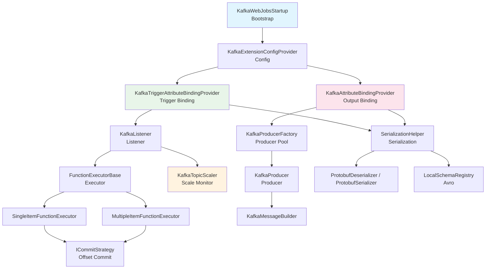
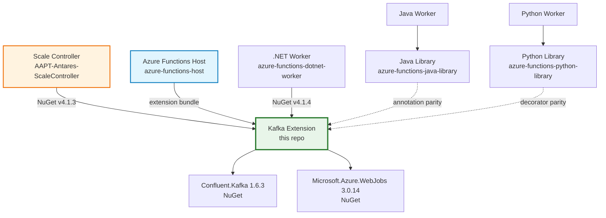

# Azure Functions Kafka Extension — Architecture

> **Purpose**: This document describes the architecture, dependency constraints, and invariants of the Azure Functions Kafka Extension. It is intended for both human developers and coding agents to prevent accidental breaking changes.

## Table of Contents

- [1. Overview](#1-overview)
- [2. Repository Structure](#2-repository-structure)
- [3. Dependency Graph](#3-dependency-graph)
- [4. Architectural Layers](#4-architectural-layers)
- [5. Trigger Binding Architecture](#5-trigger-binding-architecture)
- [6. Output Binding Architecture](#6-output-binding-architecture)
- [7. Serialization](#7-serialization)
- [8. Scaling & Monitoring](#8-scaling--monitoring)
- [9. Cross-Repository Dependencies](#9-cross-repository-dependencies)
- [10. Public API Surface (Do Not Break)](#10-public-api-surface-do-not-break)
- [11. Architectural Invariants & Constraints](#11-architectural-invariants--constraints)
- [12. Message Flow Diagrams](#12-message-flow-diagrams)

---

## 1. Overview

The Azure Functions Kafka Extension provides **trigger** (input) and **output** bindings for Apache Kafka, enabling Azure Functions to consume from and produce to Kafka topics. It is built on top of the [Confluent.Kafka](https://github.com/confluentinc/confluent-kafka-dotnet) .NET client (librdkafka).

```
┌──────────────────────────────────────────┐
│          Azure Functions Host            │
│  ┌────────────────────────────────────┐  │
│  │   Kafka Extension (this repo)     │  │
│  │  ┌──────────┐  ┌───────────────┐  │  │
│  │  │ Trigger  │  │    Output     │  │  │
│  │  │ Binding  │  │    Binding    │  │  │
│  │  └─────┬────┘  └──────┬───────┘  │  │
│  │        │               │          │  │
│  │  ┌─────▼───────────────▼───────┐  │  │
│  │  │     Confluent.Kafka 1.6.3   │  │  │
│  │  │         (librdkafka)        │  │  │
│  │  └─────────────────────────────┘  │  │
│  └────────────────────────────────────┘  │
└──────────────────────────────────────────┘
```

**Target Framework**: `netstandard2.0`

---

## 2. Repository Structure

```
src/Microsoft.Azure.WebJobs.Extensions.Kafka/
├── Root (Bootstrap & Data Models)
│   ├── KafkaWebJobsStartup.cs .................. [assembly: WebJobsStartup] entry point
│   ├── IKafkaEventData.cs ...................... Event envelope interface (PUBLIC API)
│   ├── KafkaEventData.cs ....................... Generic event data classes (PUBLIC API)
│   ├── IKafkaEventDataHeader[s].cs ............. Header interfaces (PUBLIC API)
│   └── KafkaEventDataHeader[s].cs .............. Header implementations
│
├── Config/ ..................................... Configuration & DI wiring
│   ├── KafkaExtensionConfigProvider.cs ......... IExtensionConfigProvider — wires trigger + output
│   ├── KafkaWebJobsBuilderExtensions.cs ........ AddKafka() extension + AddKafkaScaleForTrigger()
│   ├── KafkaOptions.cs ......................... Global extension options (PUBLIC API)
│   ├── BrokerAuthenticationMode.cs ............. Auth enum (PUBLIC API)
│   ├── BrokerProtocol.cs ....................... Protocol enum (PUBLIC API)
│   └── AzureFunctionsFileHelper.cs ............. librdkafka native library loader (internal)
│
├── Trigger/ .................................... Trigger binding layer
│   ├── KafkaTriggerAttribute.cs ................ User-facing attribute (PUBLIC API)
│   ├── KafkaTriggerAttributeBindingProvider.cs . ITriggerBindingProvider (internal)
│   ├── KafkaTriggerBindingStrategy.cs .......... Binding strategy (public)
│   ├── KafkaListenerConfiguration.cs ........... Per-trigger config DTO (public)
│   ├── KafkaEventDataConvertManager.cs ......... Type conversion manager (public)
│   ├── KafkaTriggerInput.cs .................... Channel envelope (public)
│   ├── FunctionExecutorBase.cs ................. Abstract executor with Channel (public)
│   ├── SingleItemFunctionExecutor.cs ........... One-event-per-invocation (public)
│   ├── MultipleItemFunctionExecutor.cs ......... Batch invocation (public)
│   ├── ICommitStrategy.cs ...................... Offset commit interface (public)
│   ├── AsyncCommitStrategy.cs .................. Async commit implementation (public)
│   └── KafkaTriggerMetrics.cs .................. ScaleMetrics (PUBLIC API — Scale Controller contract)
│
├── Output/ ..................................... Output binding layer
│   ├── KafkaAttribute.cs ....................... User-facing attribute (PUBLIC API)
│   ├── KafkaAttributeBindingProvider.cs ........ IBindingProvider (internal wiring)
│   ├── KafkaAttributeBinding.cs ................ IBinding (internal)
│   ├── KafkaProducerEntity.cs .................. Producer config DTO (public)
│   ├── IKafkaProducer.cs ....................... Producer interface (PUBLIC API)
│   ├── KafkaProducer.cs ........................ Generic producer (internal)
│   ├── KafkaProducerFactory.cs ................. Producer pooling factory (public)
│   ├── IKafkaProducerFactory.cs ................ Factory interface (PUBLIC API)
│   ├── KafkaProducerAsyncCollector.cs .......... IAsyncCollector<T> (internal)
│   ├── KafkaMessageBuilder.cs .................. Message construction (public)
│   ├── CompositeKafkaProducerBindingProvider.cs  Chain of argument binders (internal)
│   └── [Argument binding providers] ............ String, byte[], IKafkaEventData, etc. (internal)
│
├── Listeners/ .................................. Consumer lifecycle & scaling
│   ├── KafkaListener.cs ........................ IListener + IScaleMonitorProvider (internal)
│   └── KafkaTopicScaler.cs ..................... IScaleMonitor<KafkaTriggerMetrics> (PUBLIC API)
│
├── Serialization/ .............................. Format support
│   ├── SerializationHelper.cs .................. Deserializer/Serializer factory (internal)
│   ├── LocalSchemaRegistry.cs .................. Offline Avro schema registry (public)
│   ├── ProtobufDeserializer.cs ................. IDeserializer<T> for Protobuf (public)
│   └── ProtobufSerializer.cs ................... ISerializer<T> for Protobuf (public)
│
└── Extensions/ ................................. Utility helpers
    └── ConfigurationExtensions.cs .............. Config resolution (internal)
```

---

## 3. Dependency Graph

### NuGet Dependencies

| Package | Version | Purpose |
|---------|---------|---------|
| `Confluent.Kafka` | 1.6.3 | Kafka consumer/producer (librdkafka wrapper) |
| `Confluent.SchemaRegistry` | 1.6.3 | Schema registry client interface |
| `Confluent.SchemaRegistry.Serdes.Avro` | 1.6.3 | Avro serialization |
| `Confluent.SchemaRegistry.Serdes.Protobuf` | 1.6.3 | Protobuf serialization |
| `Microsoft.Azure.WebJobs` | 3.0.14 | Azure Functions host SDK (binding framework) |
| `System.Threading.Channels` | 4.5.0 | Async message passing (trigger pipeline) |

### Internal Layer Dependencies



### CRITICAL: Dependency Direction Rules

```
                  ┌─────────────────┐
                  │    Bootstrap    │ (KafkaWebJobsStartup)
                  └────────┬────────┘
                           │ depends on
                  ┌────────▼────────┐
                  │     Config      │ (KafkaExtensionConfigProvider, KafkaOptions)
                  └───┬─────────┬───┘
                      │         │
            ┌─────────▼──┐  ┌──▼──────────┐
            │  Trigger   │  │   Output    │ (Binding Providers)
            │  Binding   │  │   Binding   │
            └─────┬──────┘  └──────┬──────┘
                  │                │
            ┌─────▼──────┐  ┌─────▼──────┐
            │  Listener  │  │  Producer  │ (Infrastructure)
            │  Executor  │  │  Factory   │
            └─────┬──────┘  └─────┬──────┘
                  │                │
            ┌─────▼────────────────▼──────┐
            │    Data Models & Serialize  │ (IKafkaEventData, Serialization)
            └─────────────┬───────────────┘
                          │
            ┌─────────────▼───────────────┐
            │     Confluent.Kafka SDK     │ (External)
            └─────────────────────────────┘

RULES:
  ✅ Upper layers MAY depend on lower layers
  ❌ Lower layers MUST NOT depend on upper layers
  ❌ Trigger Binding MUST NOT depend on Output Binding
  ❌ Output Binding MUST NOT depend on Trigger Binding
  ❌ Data Models MUST NOT depend on any layer above
  ❌ Serialization MUST NOT depend on Listener/Producer/Binding layers
```

---

## 4. Architectural Layers

| Layer | Classes | Responsibility |
|-------|---------|---------------|
| **Bootstrap** | `KafkaWebJobsStartup` | `[assembly: WebJobsStartup]` — registers extension with host |
| **Config** | `KafkaExtensionConfigProvider`, `KafkaOptions`, `KafkaWebJobsBuilderExtensions` | DI registration, extension initialization, global configuration |
| **Trigger Binding** | `KafkaTriggerAttribute`, `KafkaTriggerAttributeBindingProvider`, `KafkaTriggerBindingStrategy` | Attribute → binding → listener wiring |
| **Output Binding** | `KafkaAttribute`, `KafkaAttributeBindingProvider`, `CompositeKafkaProducerBindingProvider` | Attribute → binding → producer wiring |
| **Listener / Executor** | `KafkaListener`, `FunctionExecutorBase`, `SingleItemFunctionExecutor`, `MultipleItemFunctionExecutor` | Consumer lifecycle, message dispatch, offset commit |
| **Producer** | `KafkaProducerFactory`, `KafkaProducer`, `KafkaMessageBuilder` | Producer pooling, message construction, delivery |
| **Scaling** | `KafkaTopicScaler`, `KafkaTriggerMetrics` | Lag-based scale monitoring for host/Scale Controller |
| **Serialization** | `SerializationHelper`, `ProtobufDeserializer`, `ProtobufSerializer`, `LocalSchemaRegistry` | Format detection, Avro/Protobuf codec creation |
| **Data Models** | `IKafkaEventData`, `KafkaEventData<T>`, `KafkaEventDataHeaders` | Event envelope shared across all layers |

---

## 5. Trigger Binding Architecture

### Binding Pipeline

```
[KafkaTriggerAttribute] on user function parameter
        │
        ▼
KafkaTriggerAttributeBindingProvider.TryCreateAsync()
        │  ── resolves key/value types via SerializationHelper
        │  ── creates KafkaListenerConfiguration
        ▼
KafkaListener<TKey, TValue> created (lazy start)
        │
        ▼  StartAsync()
┌───────────────────────────────────────────┐
│ Consumer Thread (Confluent.Kafka Consumer) │
│   consumer.Consume() loop                  │
│        │                                   │
│        ▼                                   │
│   Channel<IKafkaEventData[]>               │
│   (bounded, SingleReader, SingleWriter)     │
└───────────┬───────────────────────────────┘
            │
            ▼ Reader Task
┌───────────────────────────────────────┐
│ FunctionExecutor (Single or Multiple) │
│                                       │
│ Single: Group by partition → parallel │
│         tasks per partition → invoke  │
│         function → commit per msg     │
│                                       │
│ Multiple: Batch all → single invoke   │
│           → commit batch offsets      │
└───────────────────────────────────────┘
```

### Offset Commit Flow

1. Function executor groups messages by partition
2. For each successful invocation, computes max offset + 1 per partition
3. Calls `ICommitStrategy.Commit(TopicPartitionOffset[])`
4. `AsyncCommitStrategy` calls `consumer.StoreOffset()` per partition
5. Confluent.Kafka autocommit flushes stored offsets periodically

### Key Classes

| Class | Visibility | Responsibility |
|-------|-----------|---------------|
| `KafkaTriggerAttribute` | **public sealed** | User-facing trigger attribute |
| `KafkaTriggerAttributeBindingProvider` | **internal** | Creates listener from attribute metadata |
| `KafkaListener<TKey, TValue>` | **internal** | Consumer lifecycle, IScaleMonitorProvider |
| `FunctionExecutorBase<TKey, TValue>` | **public abstract** | Channel-based message processing |
| `SingleItemFunctionExecutor<TKey, TValue>` | **public** | One event per invocation, parallel per partition |
| `MultipleItemFunctionExecutor<TKey, TValue>` | **public** | Batch invocation |
| `ICommitStrategy<TKey, TValue>` | **public interface** | Offset commit abstraction |
| `AsyncCommitStrategy<TKey, TValue>` | **public** | StoreOffset-based async commit |
| `KafkaTriggerMetrics` | **public** | `TotalLag` + `PartitionCount` (Scale Controller contract) |

---

## 6. Output Binding Architecture

### Producer Pipeline

```
[KafkaAttribute] on user function parameter (out T, IAsyncCollector<T>)
        │
        ▼
KafkaAttributeBindingProvider → inspects parameter type
        │
        ▼
CompositeKafkaProducerBindingProvider (chain of responsibility)
  ├── AsyncCollectorArgumentBindingProvider   (IAsyncCollector<T>)
  ├── KafkaEventDataArgumentBindingProvider   (IKafkaEventData)
  ├── StringArgumentBindingProvider           (string)
  ├── ByteArrayArgumentBindingProvider        (byte[])
  └── SerializableTypeArgumentBindingProvider (POCOs)
        │
        ▼
KafkaProducerEntity (config DTO + factory ref)
        │
        ▼
KafkaProducerFactory (ConcurrentDictionary pool)
  └── ProducerBuilder<byte[], byte[]>  ── base producer
      └── DependentProducerBuilder<TKey, TValue>  ── typed handle
        │
        ▼
KafkaProducer<TKey, TValue>.ProduceAsync()
  └── KafkaMessageBuilder.BuildFrom(IKafkaEventData) → Message<TKey, TValue>
        │
        ▼
Confluent.Kafka IProducer<TKey, TValue> → Kafka Broker
```

### Producer Pooling

Producers are **pooled** by configuration key (broker list + all settings). All functions sharing the same broker list reuse a single base `IProducer<byte[], byte[]>`. Each unique `{topic, TKey, TValue}` combination gets a `DependentProducerBuilder` wrapping the base handle.

Producers are **never disposed** until application shutdown — this is by design for connection reuse.

---

## 7. Serialization

| Format | Deserializer | Serializer | Schema Support |
|--------|-------------|-----------|---------------|
| **String** | Direct (no codec) | Direct | N/A |
| **byte[]** | Direct (no codec) | Direct | N/A |
| **Protobuf** | `ProtobufDeserializer<T>` | `ProtobufSerializer<T>` | Compile-time (IMessage\<T\>) |
| **Avro (Specific)** | Confluent `AvroDeserializer<T>` | Confluent `AvroSerializer<T>` | `LocalSchemaRegistry` |
| **Avro (Generic)** | Confluent `AvroDeserializer<GenericRecord>` | Confluent `AvroSerializer<GenericRecord>` | `LocalSchemaRegistry` + schema string |

**`SerializationHelper`** (internal static) is the factory that resolves the correct deserializer/serializer based on the value type and schema string from the attribute.

**`LocalSchemaRegistry`** is a local-only implementation of `ISchemaRegistryClient` that holds a single schema string — no network calls to a remote schema registry.

---

## 8. Scaling & Monitoring

### Scale Controller Contract

The Kafka Extension integrates with the Azure Functions Scale Controller via two interfaces:

```
KafkaListener<TKey, TValue>
  implements IScaleMonitorProvider
    └── GetMonitor() → KafkaTopicScaler<TKey, TValue>

KafkaTopicScaler<TKey, TValue>
  implements IScaleMonitor<KafkaTriggerMetrics>
    ├── GetMetricsAsync() → Task<KafkaTriggerMetrics>
    ├── GetScaleStatus(ScaleStatusContext) → ScaleStatus
    └── Descriptor: ScaleMonitorDescriptor
```

### KafkaTriggerMetrics (Scale Controller Contract — DO NOT BREAK)

```csharp
public class KafkaTriggerMetrics : ScaleMetrics
{
    public long TotalLag { get; set; }       // Sum of lag across all partitions
    public long PartitionCount { get; set; }  // Number of topic partitions
}
```

### Scale Decision Logic (in KafkaTopicScaler)

- **Scale UP**: Lag is increasing across consecutive metric samples
- **Scale DOWN**: Lag ≈ 0 and idle for multiple sample periods
- **Lag Threshold**: Configurable via `lagThreshold` (default: 10 messages/partition)

### Scale Controller Integration

The Scale Controller (separate repo: `AAPT-Antares-ScaleController`) references the Kafka Extension as a **NuGet package** (`Microsoft.Azure.WebJobs.Extensions.Kafka v4.1.3`). It uses **reflection-based delegation**:

```
Scale Controller                         Kafka Extension
──────────────                          ─────────────────
Reads function.json
  → type = "kafkaTrigger"
  → calls builder.AddKafka()
  → calls builder.AddTriggerScale(
      typeof(KafkaWebJobsBuilderExtensions),
      "AddKafkaScaleForTrigger",     ──→  Registers KafkaTopicScaler in DI
      metadata)
                                     ←──  IScaleMonitor<KafkaTriggerMetrics>
Polls GetMetricsAsync()
Evaluates GetScaleStatus()
Makes scale decision
```

### function.json Fields (Scale Controller reads these)

| Field | Type | Required | Description |
|-------|------|----------|-------------|
| `type` | string | yes | Must be `"kafkaTrigger"` |
| `topic` | string | yes | Kafka topic name |
| `brokerList` | string | yes | Broker endpoints |
| `consumerGroup` | string | yes | Consumer group ID |
| `lagThreshold` | int | no | Scale threshold (default: 10) |
| `protocol` | string | no | Security protocol |
| `authenticationMode` | string | no | Auth mechanism |
| `username` | string | no | SASL username |
| `password` | string | no | SASL password |
| `sslCaPEM` | string | no | SSL CA certificate |

---

## 9. Cross-Repository Dependencies

### Dependency Map



### Language-Specific Status

| Language | Worker/Library | Kafka Support | Dependency Direction |
|----------|---------------|---------------|---------------------|
| **.NET (In-Process)** | N/A | ✅ Direct NuGet reference to this extension | Worker → Extension |
| **.NET (Isolated)** | `azure-functions-dotnet-worker` | ✅ `Worker.Extensions.Kafka` project (NuGet v4.1.4) | Worker → Extension |
| **Java** | `azure-functions-java-library` | ✅ `@KafkaTrigger` / `@KafkaOutput` annotations | Library maintains annotation parity |
| **Python** | `azure-functions-python-library` | ✅ `@kafka_trigger()` / `@kafka_output()` decorators, `KafkaEvent` class | Library maintains decorator parity |
| **Node.js** | `azure-functions-nodejs-library` | ❌ No Kafka bindings | N/A |
| **PowerShell** | `azure-functions-powershell-library` | ❌ No Kafka bindings | N/A |

### Cross-Repo API Parity Requirements

Language workers must keep **attribute/annotation/decorator parameters** in sync with the Kafka Extension's `KafkaTriggerAttribute` and `KafkaAttribute` properties. Key parameters that must match:

- `brokerList`, `topic`, `consumerGroup`
- `authenticationMode` (enum values must match `BrokerAuthenticationMode`)
- `protocol` (enum values must match `BrokerProtocol`)
- `keyDataType` / `KafkaMessageKeyType` (String, Bytes)
- SASL/SSL configuration properties
- `lagThreshold`, `maxMessageBytes`

---

## 10. Public API Surface (Do Not Break)

### Tier 1: User-Facing API (Breaking change = major version bump)

These are used directly by Azure Functions users in their code:

| Type | Kind | Notes |
|------|------|-------|
| `KafkaTriggerAttribute` | Attribute | Constructor, all public properties |
| `KafkaAttribute` | Attribute | Constructor, all public properties |
| `IKafkaEventData` | Interface | All properties: Value, Key, Offset, Partition, Topic, Timestamp, Headers |
| `KafkaEventData<TKey, TValue>` | Class | Constructors, typed properties |
| `KafkaEventData<TValue>` | Class | Constructors, factory methods |
| `IKafkaEventDataHeaders` | Interface | Count, indexer |
| `IKafkaEventDataHeader` | Interface | Key, Value |
| `KafkaOptions` | Class | All configuration properties |
| `BrokerAuthenticationMode` | Enum | All enum values and their names |
| `BrokerProtocol` | Enum | All enum values and their names |
| `IKafkaProducer` | Interface | ProduceAsync signature |

### Tier 2: Host/Scale Controller Contract (Breaking change = coordinated release)

These are consumed by the Azure Functions Host and Scale Controller:

| Type | Kind | Consumer | Notes |
|------|------|----------|-------|
| `KafkaTriggerMetrics` | Class | Scale Controller | `TotalLag`, `PartitionCount` properties |
| `KafkaTopicScaler<TKey, TValue>` | Class | Scale Controller | `IScaleMonitor<KafkaTriggerMetrics>` contract |
| `KafkaWebJobsBuilderExtensions` | Static Class | Scale Controller | `AddKafka()`, `AddKafkaScaleForTrigger()` methods |
| `KafkaWebJobsStartup` | Class | Host | `[assembly: WebJobsStartup]` entry point |
| `KafkaExtensionConfigProvider` | Class | Host | `IExtensionConfigProvider.Initialize()` |

### Tier 3: function.json Binding Schema (Breaking change = all language workers affected)

| Field | Used by |
|-------|---------|
| `type: "kafkaTrigger"` | Scale Controller trigger detection |
| `topic`, `brokerList`, `consumerGroup` | Scale Controller metrics + all workers |
| All auth/SSL fields | Scale Controller env var resolution |
| `lagThreshold` | Scale Controller scaling decisions |

---

## 11. Architectural Invariants & Constraints

### CONSTRAINT-1: Dependency Direction (Layer Separation)

```
❌ FORBIDDEN dependency directions:
  - Trigger/* → Output/*  (trigger must not depend on output)
  - Output/* → Trigger/*  (output must not depend on trigger)
  - Data Models (IKafkaEventData, KafkaEventData) → ANY layer above
  - Serialization/* → Listeners/*, Trigger/*, Output/*
  - Config/* → Listeners/*, Trigger/Executor/*
```

**Why**: Layer violations create circular dependencies and make it impossible to use components independently (e.g., a future scenario where output binding is used without trigger).

### CONSTRAINT-2: Confluent.Kafka Isolation

Only these classes may directly reference `Confluent.Kafka` types:

| Class | Allowed Confluent.Kafka usage |
|-------|------------------------------|
| `KafkaListener` | `IConsumer<TKey, TValue>`, `ConsumerBuilder`, `ConsumeResult` |
| `KafkaProducerFactory` | `ProducerBuilder<byte[], byte[]>` |
| `KafkaProducer` | `DependentProducerBuilder`, `IProducer` |
| `KafkaTopicScaler` | `IAdminClient`, `AdminClientBuilder` |
| `KafkaMessageBuilder` | `Message<TKey, TValue>`, `Headers` |
| `KafkaEventData` | `ConsumeResult<TKey, TValue>` (constructor) |
| `KafkaEventDataHeaders` | `Headers` (wrapping) |
| `SerializationHelper` | `IDeserializer<T>`, `ISerializer<T>` |
| `AsyncCommitStrategy` | `IConsumer<TKey, TValue>.StoreOffset()` |
| `KafkaListenerConfiguration` | `SaslMechanism`, `SecurityProtocol` enums |
| `BrokerAuthenticationMode` / `BrokerProtocol` | Enum mapping to Confluent types |

**Why**: Isolating Confluent.Kafka references to specific classes makes it possible to upgrade the Confluent.Kafka version with minimal blast radius.

### CONSTRAINT-3: Channel Contract (FunctionExecutorBase)

```csharp
// Channel is configured as:
Channel.CreateBounded<IKafkaEventData[]>(new BoundedChannelOptions(1)
{
    SingleReader = true,
    SingleWriter = true,
});
```

- **SingleWriter**: Only `KafkaListener` writes to the channel
- **SingleReader**: Only the executor's reader task reads from the channel
- **Capacity = 1**: Backpressure — consumer blocks until executor processes current batch

**Do not** change channel capacity or reader/writer cardinality without understanding the threading implications.

### CONSTRAINT-4: Producer Pooling Invariant

`KafkaProducerFactory` maintains a `ConcurrentDictionary<string, IProducer<byte[], byte[]>>` of base producers, keyed by a hash of all producer configuration values.

- **One base producer per unique config** — never create duplicate producers for the same config
- **Producers are never disposed during normal operation** — only at app shutdown
- **DependentProducerBuilder** wraps the base handle — lightweight, can be created per-call

### CONSTRAINT-5: KafkaTriggerMetrics Stability

`KafkaTriggerMetrics` is serialized/deserialized by the Scale Controller. Any change to this class is a **coordinated release** requiring both:
1. Kafka Extension version bump + NuGet publish
2. Scale Controller `SharedReferences.props` update + deploy

Properties that **must not change type or be removed**:
- `TotalLag` (long)
- `PartitionCount` (long)

Adding new optional properties is safe. Removing or renaming existing properties is a **breaking change**.

### CONSTRAINT-6: Enum Value Stability

`BrokerAuthenticationMode` and `BrokerProtocol` enums are serialized to/from `function.json` and across language worker boundaries. Existing enum values **must not be renamed or removed**. New values can only be **appended**.

### CONSTRAINT-7: Attribute Constructor Stability

`KafkaTriggerAttribute(string brokerList, string topic)` and `KafkaAttribute(string brokerList, string topic)` constructors are used in compiled user functions. Changing constructor signatures is a **binary breaking change**. `KafkaAttribute` also has a parameterless constructor. New configuration should be added as **optional properties**, not constructor parameters.

### CONSTRAINT-8: IScaleMonitor Contract

`KafkaTopicScaler<TKey, TValue>` implements `IScaleMonitor<KafkaTriggerMetrics>`. The interface contract is defined by `Microsoft.Azure.WebJobs` and the Scale Controller depends on it.

- `GetMetricsAsync()` must return `Task<KafkaTriggerMetrics>`
- `GetScaleStatus()` must accept `ScaleStatusContext`
- `Descriptor` must be formatted as `"{functionId}-kafkatrigger-{topic}-{consumerGroup}"`

### CONSTRAINT-9: WebJobsStartup Assembly Attribute

```csharp
[assembly: WebJobsStartup(typeof(KafkaWebJobsStartup))]
```

This attribute in `KafkaWebJobsStartup.cs` is the **entry point** for the Azure Functions Host to discover and load the extension. The class name and namespace must not change.

### CONSTRAINT-10: Thread Safety

| Component | Thread Safety | Notes |
|-----------|-------------|-------|
| `KafkaProducerFactory` | Thread-safe | `ConcurrentDictionary` for producer pool |
| `KafkaListener` | Start/Stop on any thread | Single consumer thread internally |
| `FunctionExecutorBase` channel | Dedicated reader/writer | `SingleReader=true, SingleWriter=true` |
| `IConsumer<TKey, TValue>` | **NOT thread-safe** | Single-threaded access enforced by listener |
| `IProducer<TKey, TValue>` | Thread-safe | Confluent.Kafka producer is thread-safe |

---

## 12. Message Flow Diagrams

### Trigger: Single-Item Dispatch

```
Kafka Broker
    │
    ▼ consumer.Consume()
KafkaListener (consumer thread)
    │ wraps ConsumeResult → IKafkaEventData
    │ batches into IKafkaEventData[]
    ▼
Channel<IKafkaEventData[]>  (capacity=1, backpressure)
    │
    ▼ Reader task
SingleItemFunctionExecutor
    │ Groups events by partition:
    │   Partition 0: [msg1, msg4, msg7]
    │   Partition 1: [msg2, msg5]
    │   Partition 2: [msg3, msg6]
    │
    ├── Task (Partition 0): invoke(msg1) → commit → invoke(msg4) → commit → ...
    ├── Task (Partition 1): invoke(msg2) → commit → invoke(msg5) → commit → ...
    └── Task (Partition 2): invoke(msg3) → commit → invoke(msg6) → commit → ...
    
    (Cross-partition: PARALLEL)
    (Within-partition: SEQUENTIAL, ordered)
```

### Trigger: Multiple-Item (Batch) Dispatch

```
Kafka Broker
    │
    ▼ consumer.Consume()
KafkaListener (consumer thread)
    │ wraps ConsumeResult → IKafkaEventData
    │ batches into IKafkaEventData[]
    ▼
Channel<IKafkaEventData[]>  (capacity=1, backpressure)
    │
    ▼ Reader task
MultipleItemFunctionExecutor
    │ Computes offset map: {partition → max_offset + 1}
    │ Single invocation: function(IKafkaEventData[])
    │ On success → commit all partition offsets
    │ On failure → NO commit (at-least-once semantics)
```

### Output: Message Production

```
User function code
    │
    ▼ collector.AddAsync(item)
KafkaProducerAsyncCollector
    │ Converts item → IKafkaEventData
    │   string → JSON parse attempt → KafkaEventData
    │   byte[] →  KafkaEventData<byte[]>
    │   T → KafkaEventData<T>
    ▼
KafkaProducerEntity.SendAndCreateEntityIfNotExistsAsync()
    │
    ▼ factory.Create(attribute, valueType)
KafkaProducerFactory (pooled)
    │ Reuses or creates base IProducer<byte[], byte[]>
    │ Creates DependentProducerBuilder<TKey, TValue>
    ▼
KafkaProducer<TKey, TValue>.ProduceAsync()
    │ KafkaMessageBuilder.BuildFrom(IKafkaEventData) → Message<TKey, TValue>
    ▼
Confluent.Kafka IProducer → Kafka Broker
```

---

## Appendix A: Configuration Resolution Order

1. Attribute property string literals
2. `%name%` → environment variable / app settings resolution via `INameResolver`
3. `[ConnectionString]` → Key Vault / connection string provider
4. `IConfiguration` overrides (from `host.json` "kafka" section → `KafkaOptions`)
5. Confluent.Kafka `ClientConfig` defaults (librdkafka)

## Appendix B: Error Handling Invariants

| Scenario | Behavior | Offset Committed? |
|----------|----------|-------------------|
| Function invocation succeeds | Normal flow | ✅ Yes |
| Function invocation throws | Exception logged | ❌ No (at-least-once) |
| Consumer error callback | Logged, not thrown | N/A |
| Serialization error | Thrown to caller | ❌ No |
| Channel full (backpressure) | Writer blocks until space available | N/A |
| Producer delivery failure | Exception propagated to function | N/A |

## Appendix C: Native Library Loading

`AzureFunctionsFileHelper` (internal) handles loading the `librdkafka` native binaries:

1. Detects runtime environment (Azure Functions vs. container vs. local dev)
2. Searches `runtimes/{rid}/native/` directory in NuGet package layout
3. Sets `LIBRDKAFKA_LOCATION` environment variable
4. Confluent.Kafka loads from this location

This is sensitive to NuGet package layout changes and platform-specific paths.
