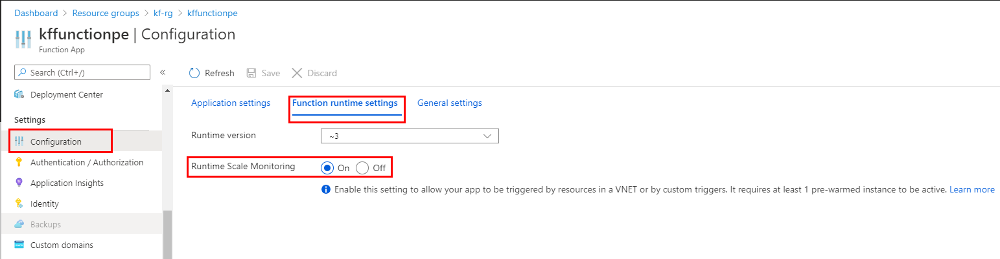

# Public Documentation

**NOTE:** The Kafka bindings are only fully supported on [Premium](https://docs.microsoft.com/en-us/azure/azure-functions/functions-premium-plan) and [Dedicated App Service](https://docs.microsoft.com/en-us/azure/azure-functions/dedicated-plan) plans. Consumption plans are not supported.

**NOTE:** Kafka bindings are only supported for Azure Functions version 3.x and later versions.

Use the Kafka output binding to send messages to a Kafka topic
For information on setup and configuration details, see the overview

# Examples

## C#

The C# function can be created using one of the following C# modes:

- [In-process class library](https://docs.microsoft.com/en-us/azure/azure-functions/functions-dotnet-class-library): compiled C# function that runs in the same process as the Functions runtime.
- [Isolated process class library](https://docs.microsoft.com/en-us/azure/azure-functions/dotnet-isolated-process-guide): compiled C# function that runs in a process isolated from the runtime. Isolated process is required to support C# functions running on .NET 5.0.

The following example shows a C# function that reads and logs the Kafka message as a KafkaEvent:

### InProcess
The following example shows a C# function that reads and logs the Kafka message as a KafkaEvent:

```csharp
[FunctionName("KafkaTrigger")]
public static void Run(
    [KafkaTrigger("BrokerList",
                    "topic",
                    Username = "ConfluentCloudUserName",
                    Password = "ConfluentCloudPassword",
                    Protocol = BrokerProtocol.SaslSsl,
                    AuthenticationMode = BrokerAuthenticationMode.Plain,
                    ConsumerGroup = "$Default")] KafkaEventData<string> kevent, ILogger log)
{            
    log.LogInformation($"C# Kafka trigger function processed a message: {kevent.Value}");
}
```

To receive events in a batch, make string or KafkaEventData an array.

```csharp
[FunctionName("KafkaTriggerMany")]
public static void Run(
    [KafkaTrigger("BrokerList",
                    "topic",
                    Username = "ConfluentCloudUserName",
                    Password = "ConfluentCloudPassword",
                    Protocol = BrokerProtocol.SaslSsl,
                    AuthenticationMode = BrokerAuthenticationMode.Plain,
                    ConsumerGroup = "$Default")] KafkaEventData<string>[] events, ILogger log)
{       
    foreach (KafkaEventData<string> kevent in events)
    {    
        log.LogInformation($"C# Kafka trigger function processed a message: {kevent.Value}");
    }
}
```

The following function logs the message and headers for that KafkaEvent. 

```csharp
[FunctionName("KafkaTriggerWithHeaders")]
public static void Run(
    [KafkaTrigger("BrokerList",
                    "topic",
                    Username = "ConfluentCloudUserName",
                    Password = "ConfluentCloudPassword",
                    Protocol = BrokerProtocol.SaslSsl,
                    AuthenticationMode = BrokerAuthenticationMode.Plain,
                    ConsumerGroup = "$Default")] KafkaEventData<string> kevent, ILogger log)
{
    log.LogInformation($"C# Kafka trigger function processed a message: {kevent.Value}");
    log.LogInformation("Headers: ");
    var headers = kevent.Headers;
    foreach (var header in headers)
    {
        log.LogInformation($"Key = {header.Key} Value = {System.Text.Encoding.UTF8.GetString(header.Value)}");
    }
}
```

### IsolatedProcess
```csharp
[Function("KafkaTrigger")]
public static void Run(
    [KafkaTrigger("BrokerList",
                    "topic",
                    Username = "ConfluentCloudUserName",
                    Password = "ConfluentCloudPassword",
                    Protocol = BrokerProtocol.SaslSsl,
                    AuthenticationMode = BrokerAuthenticationMode.Plain,
                    ConsumerGroup = "$Default")] string eventData, FunctionContext context)
{
    var logger = context.GetLogger("KafkaFunction");
    logger.LogInformation($"C# Kafka trigger function processed a message: {JObject.Parse(eventData)["Value"]}");
}
```

To receive events in a batch, make string an array.

```csharp
[Function("KafkaTriggerMany")]
public static void Run(
    [KafkaTrigger("BrokerList",
                    "topic",
                    Username = "ConfluentCloudUserName",
                    Password = "ConfluentCloudPassword",
                    Protocol = BrokerProtocol.SaslSsl,
                    AuthenticationMode = BrokerAuthenticationMode.Plain,
                    ConsumerGroup = "$Default",
                    IsBatched = true)] string[] events, FunctionContext context)
{
    foreach (var kevent in events)
    {
        var logger = context.GetLogger("KafkaFunction");
        logger.LogInformation($"C# Kafka trigger function processed a message: {JObject.Parse(kevent)["Value"]}");
    }
}
```

## Java

The following Java function uses the @KafkaTrigger annotation from the Java Client library (https://mvnrepository.com/artifact/com.microsoft.azure.functions/azure-functions-java-library) to describe the configuration for a KafkaTrigger trigger. The function grabs the message placed on the topic and adds it to the logs.

```java
@FunctionName("KafkaTrigger")
public void runSingle(
        @KafkaTrigger(
            name = "KafkaTrigger",
            topic = "topic",  
            brokerList="%BrokerList%",
            consumerGroup="$Default", 
            username = "%ConfluentCloudUsername%", 
            password = "ConfluentCloudPassword",
            authenticationMode = BrokerAuthenticationMode.PLAIN,
            protocol = BrokerProtocol.SASLSSL,
            dataType = "string") String kafkaEventData,
        final ExecutionContext context) 
    {
        context.getLogger().info(kafkaEventData);
    }
```

To receive events in a batch, change type to an array. In the following function, the trigger annotation is applied to an array of string and the cardinality parameter is changed to Cardinality.MANY. 

```java
@FunctionName("KafkaTriggerMany")
public void runMany(
        @KafkaTrigger(
            name = "kafkaTriggerMany",
            topic = "topic",  
            brokerList="%BrokerList%",
            consumerGroup="$Default", 
            username = "%ConfluentCloudUsername%", 
            password = "ConfluentCloudPassword",
            authenticationMode = BrokerAuthenticationMode.PLAIN,
            protocol = BrokerProtocol.SASLSSL,
            cardinality = Cardinality.MANY,
            dataType = "string"
            ) String[] kafkaEvents,
        final ExecutionContext context) {
        for (String kevent: kafkaEvents) {
            context.getLogger().info(kevent);
        }    
}
```

The following function logs the message and headers for that KafkaEvent. 

```java
@FunctionName("KafkaTriggerWithHeaders")
public void runSingle(
        @KafkaTrigger(
            name = "KafkaTrigger",
            topic = "topic",  
            brokerList="%BrokerList%",
            consumerGroup="$Default", 
            username = "%ConfluentCloudUsername%", 
            password = "ConfluentCloudPassword",
            authenticationMode = BrokerAuthenticationMode.PLAIN,
            protocol = BrokerProtocol.SASLSSL
            ) KafkaEntity kafkaEventData,
        final ExecutionContext context) {
        context.getLogger().info("Java Kafka trigger function called for message: " + kafkaEventData.Value);
        context.getLogger().info("Headers for the message:");
        for (KafkaHeaders header : kafkaEventData.Headers) {
            String decodedValue = new String(Base64.getDecoder().decode(header.Value));
            context.getLogger().info("Key:" + header.Key + " Value:" + decodedValue);                    
        }
}
```

## Javascript

The following example shows a Kafka trigger binding in a function.json file and a [JavaScript](https://docs.microsoft.com/en-us/azure/azure-functions/functions-reference-node) function that uses the binding. The function reads and logs a Kafka  message.

Here's the binding data in the function.json file:
```json
{
    "bindings": [
        {
            "type": "kafkaTrigger",
            "name": "event",
            "direction": "in",
            "topic": "topic",
            "brokerList": "%BrokerList%",
            "username": "%ConfluentCloudUserName%",
            "password": "%ConfluentCloudPassword%",
            "protocol": "saslSsl",
            "authenticationMode": "plain",
            "consumerGroup" : "$Default",
            "dataType": "string"
        }
    ]
}
```
Here's the JavaScript script code:
```js
module.exports = async function (context, event) {
    context.log.info(`JavaScript Kafka trigger function called for message ${event.Value}`);
};
```

To receive events in a batch, set cardinality to many in the function.json file, as shown in the following examples.
```json
{
    "bindings": [
        {
            "type": "kafkaTrigger",
            "name": "event",
            "direction": "in",
            "protocol" : "SASLSSL",
            "password" : "%ConfluentCloudPassword%",
            "dataType" : "string",
            "topic" : "topic",
            "authenticationMode" : "PLAIN",
            "cardinality" : "MANY",
            "consumerGroup" : "$Default",
            "username" : "%ConfluentCloudUserName%",
            "brokerList" : "%BrokerList%"
        }
    ]
}
```
Here's the Javascript code: 
```js
module.exports = async function (context, events) {
    function print(event) {
        var eventJson = JSON.parse(event)
        context.log.info(`JavaScript Kafka trigger function called for message ${eventJson.Value}`);
    }
    events.map(print);
};
```


The following function logs the message and headers for that KafkaEvent. 

```js
module.exports = async function (context, event) {
    var keventJson = JSON.parse(kevent)
    context.log.info(`JavaScript Kafka trigger function called for message ${keventJson.Value}`);
    context.log.info(`Headers for this message:`)
    let headers =  keventJson.Headers;
    headers.forEach(element => {
        context.log.info(`Key: ${element.Key} Value:${Buffer.from(element.Value, 'base64')}`) 
    });
};
```

## Powershell
The following example demonstrates how to read a Kafka message passed to a function via a trigger.

Kafka trigger is defined in function.json file where type is set to kafkaTrigger.

```json
{
    "bindings": [
      {
            "type": "kafkaTrigger",
            "name": "kafkaEvent",
            "direction": "in",
            "protocol" : "SASLSSL",
            "password" : "%ConfluentCloudPassword%",
            "dataType" : "string",
            "topic" : "topic",
            "authenticationMode" : "PLAIN",
            "consumerGroup" : "$Default",
            "username" : "%ConfluentCloudUserName%",
            "brokerList" : "%BrokerList%",
            "sslCaLocation": "confluent_cloud_cacert.pem"
        }
    ]
}
```

The code in the Run.ps1 file declares a parameter as $kafkaEvent, which allows you to read the kafka event message in your function.

```ps1
using namespace System.Net

param($kafkaEvent, $TriggerMetadata)

Write-Output "Powershell Kafka trigger function called for message $kafkaEvent.Value"
```

To receive events in a batch, set cardinality to many in the function.json file, as shown in the following examples.
```json
{
    "bindings": [
      {
            "type": "kafkaTrigger",
            "name": "kafkaEvent",
            "direction": "in",
            "protocol" : "SASLSSL",
            "password" : "%ConfluentCloudPassword%",
            "dataType" : "string",
            "topic" : "topic",
            "authenticationMode" : "PLAIN",
            "cardinality" : "MANY",
            "consumerGroup" : "$Default",
            "username" : "%ConfluentCloudUserName%",
            "brokerList" : "%BrokerList%",
            "sslCaLocation": "confluent_cloud_cacert.pem"
        }
    ]
}
```
Here's the Powerhsell code: 

```ps1
using namespace System.Net

param($kafkaEvents, $TriggerMetadata)

foreach ($kafkaEvent in $kafkaEvents) {
    $event = $kafkaEvent | ConvertFrom-Json -AsHashtable
    Write-Output "Powershell Kafka trigger function called for message $event.Value"
}
```

The following function logs the message and headers for that KafkaEvent. 
```ps1
using namespace System.Net

param($kafkaEvent, $TriggerMetadata)

Write-Output "Powershell Kafka trigger function called for message" + $kafkaEvent.Value
Write-Output "Headers for this message:"
foreach ($header in $kafkaEvent.Headers) {
    $DecodedValue = [System.Text.Encoding]::Unicode.GetString([System.Convert]::FromBase64String($header.Value))
    $Key = $header.Key
    Write-Output "Key: $Key Value: $DecodedValue"
}
```

## Python

The following example shows a Kafka trigger binding in a function.json file and a Python function that uses the binding. The function reads and logs a Kafka message.


A Kafka binding is defined in function.json where type is set to KafkaTrigger.

```json
{
    "scriptFile": "main.py",
    "bindings": [
        {
          "type": "kafkaTrigger",
          "name": "kevent",
          "topic": "topic",
          "brokerList": "%BrokerList%",
          "username": "%ConfluentCloudUserName%",
          "password": "%ConfluentCloudPassword%",
          "consumerGroup" : "functions",
          "protocol": "saslSsl",
          "authenticationMode": "plain"
        }
    ]
}
```
Here's the Python script code:
```py
import logging
from azure.functions import KafkaEvent

def main(kevent : KafkaEvent):
    logging.info("Python Kafka trigger function called for message " + kevent.metadata["Value"])
```

To receive events in a batch, set cardinality to many in the function.json file, as shown in the following examples.

```json
{
    "scriptFile": "main.py",
    "bindings": [
        {
            "type" : "kafkaTrigger",
            "direction": "in",
            "name" : "kevents",
            "protocol" : "SASLSSL",
            "password" : "%ConfluentCloudPassword%",
            "topic" : "message_python",
            "authenticationMode" : "PLAIN",
            "cardinality" : "MANY",
            "dataType": "string",
            "consumerGroup" : "$Default",
            "username" : "%ConfluentCloudUserName%",
            "BrokerList" : "%BrokerList%"    
        }
    ]
}
```

Here's Python code: 
```py
def main(kevents : typing.List[KafkaEvent]):
    for event in kevents:
        logging.info(event.get_body())
```


The following function logs the message and headers for that KafkaEvent. 
```py
def main(kevent : KafkaEvent):
    logging.info("Python Kafka trigger function called for message " + kevent.metadata["Value"])
    headers = json.loads(kevent.metadata["Headers"])
    for header in headers:
        logging.info("Key: "+ header['Key'] + " Value: "+ str(base64.b64decode(header['Value']).decode('ascii')))
```

### Typescript

The following example shows a Kafka trigger binding in a function.json file and a Typescript function that uses the binding. The function reads and logs a Kafka message.

Here's the binding data in the function.json file:

```json
{
    "bindings": [
      {
        "type": "kafkaTrigger",
        "direction": "in",
        "name": "event",
        "topic": "topic",
        "brokerList": "%BrokerList%",
        "username": "%ConfluentCloudUserName%",
        "password": "%ConfluentCloudPassword%",
        "consumerGroup" : "functions",
        "protocol": "saslSsl",
        "authenticationMode": "plain",
        "dataType": "string"
      }
    ],
    "scriptFile": "../dist/KafkaTrigger/index.js"
  }
```
Here's the Typescript script code:
```ts
import { AzureFunction, Context } from "@azure/functions"

// This is to describe the metadata of a Kafka event
class KafkaEvent {
    Offset : number;
    Partition : number;
    Topic : string;
    Timestamp : string;
    Value : string;
    
    constructor(metadata:any) {
        this.Offset = metadata.Offset;
        this.Partition = metadata.Partition;
        this.Topic = metadata.Topic;
        this.Timestamp = metadata.Timestamp;
        this.Value = metadata.Value;
    }

    public getValue<T>() : T {
        return JSON.parse(this.Value).payload;
    }
}

// This is a sample interface that describes the actual data in your event.
interface EventData {
    registertime : number;
    userid : string;
    regionid: string;
    gender: string;
}

const kafkaTrigger: AzureFunction = async function (context: Context, event_str: string): Promise<void> {

    let event_obj = new KafkaEvent(eval(event_str));

    context.log("Event Offset: " + event_obj.Offset);
    context.log("Event Partition: " + event_obj.Partition);
    context.log("Event Topic: " + event_obj.Topic);
    context.log("Event Timestamp: " + event_obj.Timestamp);
    context.log("Event Value (as string): " + event_obj.Value);
};

export default kafkaTrigger;
```

To receive events in a batch, set cardinality to many in the function.json file, as shown in the following examples.

```json
{
  "bindings": [
    {
      "type": "kafkaTrigger",
      "direction": "in",
      "name": "events",
      "topic": "topic",
      "brokerList": "%BrokerList%",
      "username": "%ConfluentCloudUserName%",
      "password": "%ConfluentCloudPassword%",
      "consumerGroup" : "functions",
      "protocol": "saslSsl",
      "authenticationMode": "plain",
      "cardinality": "MANY",
      "dataType": "string"
    }
  ],
  "scriptFile": "../dist/KafkaTriggerMany/index.js"
}
```

Here's Typescript code: 
```ts
const kafkaTrigger: AzureFunction = async function (context: Context, events: string[]): Promise<void> {

    for(var event of events) {
        let event_obj = new KafkaEvent(eval(event));
        context.log("Event Offset: " + event_obj.Offset);
        context.log("Event Partition: " + event_obj.Partition);
        context.log("Event Topic: " + event_obj.Topic);
        context.log("Event Timestamp: " + event_obj.Timestamp);
        context.log("Event Value (as string): " + event_obj.Value);    
    }
};

export default kafkaTrigger;
```

The following function logs the message and headers for that KafkaEvent. 
```ts
import { AzureFunction, Context } from "@azure/functions"

class KafkaHeaders {
    Key: string;
    Value: string;
}

// This is to describe the metadata of a Kafka event
class KafkaEvent {
    Offset : number;
    Partition : number;
    Topic : string;
    Timestamp : string;
    Value : string;
    Headers: KafkaHeaders[];

    constructor(metadata:any) {
        this.Offset = metadata.Offset;
        this.Partition = metadata.Partition;
        this.Topic = metadata.Topic;
        this.Timestamp = metadata.Timestamp;
        this.Value = metadata.Value;
        this.Headers = metadata.Headers;
    }

    public getValue<T>() : T {
        return JSON.parse(this.Value).payload;
    }
}

const kafkaTrigger: AzureFunction = async function (context: Context, event: string): Promise<void> {
    let event_obj = new KafkaEvent(eval(event));
    context.log("Event Offset: " + event_obj.Offset);
    context.log("Event Partition: " + event_obj.Partition);
    context.log("Event Topic: " + event_obj.Topic);
    context.log("Event Timestamp: " + event_obj.Timestamp);
    context.log("Event Value (as string): " + event_obj.Value);
    context.log("Event Headers: ");
    event_obj.Headers.forEach((header: KafkaHeaders) => {
        context.log("Key: ", header.Key, "Value: ", atob(header.Value))
    });
};

export default kafkaTrigger;
```


# C# Attributes

|Setting|Description|
|-|-|
|Topic|Topic Name used for Kafka Trigger|
|BrokerList|Server Address for kafka broker|
|ConsumerGroup|Name for the Consumer Group|
|AvroSchema|Should be used only if a generic record should be generated|
|LagThreshold|Threshold for lag(Default 1000)|

For connection to a secure Kafka Broker -

|Authentication Setting|librdkafka property|Description|
|-|-|-|
|AuthenticationMode|sasl.mechanism|SASL mechanism to use for authentication|
|Username|sasl.username|SASL username for use with the PLAIN and SASL-SCRAM|
|Password|sasl.password|SASL password for use with the PLAIN and SASL-SCRAM|
|Protocol|security.protocol|Security protocol used to communicate with brokers|
|SslKeyLocation|ssl.key.location|Path to client's private key (PEM) used for authentication|
|SslKeyPassword|ssl.key.password|Password for client's certificate|
|SslCertificateLocation|ssl.certificate.location|Path to client's certificate|
|SslCaLocation|ssl.ca.location|Path to CA certificate file for verifying the broker's certificate|

# Java Annotations
|Parameter|Description|
|-|-|
|name|The variable name used in function code for the request or request body.|
|topic|Defines the topic.|
|brokerList|Defines the broker list.|
|consumerGroup|Name for the Consumer Group.|
|cardinality|Cardinality of the trigger input. Choose 'One' if the input is a single message or 'Many' if the input is an array of messages. If you choose 'Many', please set a dataType. Default: 'One'|
|dataType| <p>Defines how Functions runtime should treat the parameter value. Possible values are:</p><ul><li>""(Default): Get the value as a string, and try to deserialize to actual parameter type like POJO.</li><li>string: Always get the value as a string</li><li>binary: Get the value as a binary data, and try to deserialize to actual parameter type byte[].</li></ul>|
|avroSchema|Avro schema for generic record deserialization|

For connection to a secure Kafka Broker -

|Authentication Setting|librdkafka property|Description|
|-|-|-|
|authenticationMode|sasl.mechanism|SASL mechanism to use for authentication|
|username|sasl.username|SASL username for use with the PLAIN and SASL-SCRAM|
|password|sasl.password|SASL password for use with the PLAIN and SASL-SCRAM|
|protocol|security.protocol|Security protocol used to communicate with brokers|
|sslKeyLocation|ssl.key.location|Path to client's private key (PEM) used for authentication|
|sslKeyPassword|ssl.key.password|Password for client's certificate|
|sslCertificateLocation|ssl.certificate.location|Path to client's certificate|
|sslCaLocation|ssl.ca.location|Path to CA certificate file for verifying the broker's certificate|

# Javascript/Typescript/Powershell/Python Configuration

The following tables explain the binding configuration properties that you set in the [function.json](https://docs.microsoft.com/en-us/azure/azure-functions/functions-reference?tabs=blob#function-code) file -

|function.json property|Description|
|-|-|
|type|Must be set to kafkaTrigger.|
|direction|Must be set to in.|
|name|Name of the variable that represents  request or request body in the function code.|
|brokerList|Defines the broker list.|
|cardinality|Cardinality of the trigger input. Choose 'One' if the input is a single message or 'Many' if the input is an array of messages. If you choose 'Many', please set a dataType. Default: 'One'|
|dataType|<p>Defines how Functions runtime should treat the parameter value. Possible values are:</p><ul><li>""(Default): Get the value as a string, and try to deserialize to actual parameter type like POJO.</li><li>string: Always get the value as a string</li><li>binary: Get the value as a binary data, and try to deserialize to actual parameter type byte[].</li></ul>|

For connection to a secure Kafka Broker -

|function.json property|librdkafka property|Description|
|-|-|-|
|authenticationMode|sasl.mechanism|SASL mechanism to use for authentication|
|username|sasl.username|SASL username for use with the PLAIN and SASL-SCRAM|
|password|sasl.password|SASL password for use with the PLAIN and SASL-SCRAM|
|protocol|security.protocol|Security protocol used to communicate with brokers|
|sslKeyLocation|ssl.key.location|Path to client's private key (PEM) used for authentication|
|sslKeyPassword|ssl.key.password|Password for client's certificate|
|sslCertificateLocation|ssl.certificate.location|Path to client's certificate|
|sslCaLocation|ssl.ca.location|Path to CA certificate file for verifying the broker's certificate|

 When you are developing locally, add your application settings in the [local.settings.json](https://docs.microsoft.com/en-us/azure/azure-functions/functions-develop-local#local-settings-file) file in the Values collection.

**NOTE:** Username and password should reference a Azure function configuration variable and not be hardcoded.


# host.json settings

This section describes the configuration settings available for this binding in versions 2.x and higher. Settings in the host.json file apply to all functions in a function app instance. For more information about function app configuration settings in versions 2.x and later versions, see [host.json reference for Azure Functions](https://docs.microsoft.com/en-us/azure/azure-functions/functions-host-json).

|Setting|Description|Default Value
|-|-|-|
|MaxBatchSize|Maximum batch size when calling a Kafka trigger function|64
|SubscriberIntervalInSeconds|Defines the minimum frequency in which messages will be executed by function. Only if the message volume is less than MaxBatchSize / SubscriberIntervalInSeconds|1
|ExecutorChannelCapacity|Defines the channel capacity in which messages will be sent to functions. Once the capacity is reached the Kafka subscriber will pause until the function catches up|1
|ChannelFullRetryIntervalInMs|Defines the interval in milliseconds in which the subscriber should retry adding items to channel once it reaches the capacity|50

The settings exposed here are to customize how librdkafka works. [Librdkafka Documentation](https://github.com/edenhill/librdkafka/blob/master/CONFIGURATION.md) for information on each setting.

|Setting|librdkafka property|
|-|-|
|ReconnectBackoffMs|reconnect.backoff.max.ms|
|ReconnectBackoffMaxMs|reconnect.backoff.max.ms|
|StatisticsIntervalMs|statistics.interval.ms|
|SessionTimeoutMs|session.timeout.ms|
|MaxPollIntervalMs|max.poll.interval.ms|
|QueuedMinMessages|queued.min.messages|
|QueuedMaxMessagesKbytes|queued.max.messages.kbytes|
|MaxPartitionFetchBytes|max.partition.fetch.bytes|
|FetchMaxBytes|fetch.max.bytes|
|AutoCommitIntervalMs|auto.commit.interval.ms|
|LibkafkaDebug|debug|
|MetadataMaxAgeMs|metadata.max.age.ms|
|SocketKeepaliveEnable|socket.keepalive.enable|

# Enable Runtime Scaling
In order for the Kafka trigger to scale out to multiple instances, the Runtime Scale Monitoring setting must be enabled.

In the portal, this setting can be found under Configuration > Function runtime settings for your function app.



In the CLI, you can enable Runtime Scale Monitoring by using the following command:

```az resource update -g <resource_group> -n <function_app_name>/config/web --set properties.functionsRuntimeScaleMonitoringEnabled=1 --resource-type Microsoft.Web/sites```