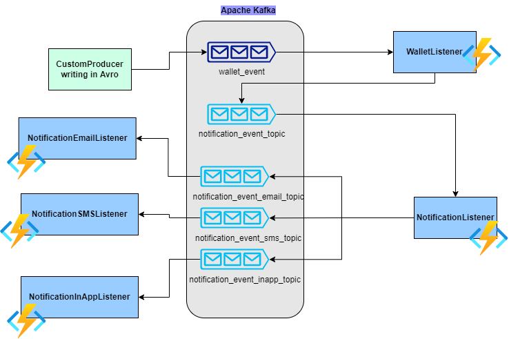

# How to run the Java

For `func start`, replace the process by following.
Java use maven. You also don't need to do `func extensions install`.

```bash
mvn clean package
mvn azure-functions:run
```

**Concept** :-
The Azure functions kafka extension supports triggers and output binding for the topic.
The scope of this application is to run the simple app in which the below functionalities will run :-
1. Avro Generic Records Triggers
    1. We are writing from outside on the kafka **wallet_event** topic after serializing the avro format
    2. Trigger will executed in function **WalletListener** this is triggered from **wallet_event** topic
    3. Trigger will perform some business logic and convert the response 
    4. The Response will consists of **Kafka Header** with notification type :-
       1. SMS
       2. Email
       3. In-App notification
    5. The Response of KafkaEvent will be sent to output binding and will write on kafka topic
2. Kafka Trigger for Header support
   1. The **NotificationListener** function will read the **notification_event_topic**
   2. Based on the event type passed in header it will read and write back on notification type :-
      1. Email -- email listener topic
      2. SMS -- sms listener topic
      3. In-App -- in-app listener notification
In the above description the listeners are kafka trigger functions

**Pre-requisite** :-
 1. Customer should have the broker on managed cloud
 2. Customer should write using the producer code in producer-package
 3. While writing in configured topic, schema registry should be up for that please run the docker-compose

The detailed description in below diagram :-

