# Azure Functions Kafka Trigger Java Sample

Let’s take a look at the scenario of wallet transaction processing – The goal of this use-case is to process the wallet transaction and notify users via email /sms/in-app. This is a fictitious example to showcase the Kafka trigger and output binding usage with Avro and header data. The code can be further customized and extended as per your requirements.
The wallet producer helps generate  wallet transactions in the Avro serialized format to kafka topic- wallet_event.
1. Once the message arrives at a Kafka topic a  function app is triggered which de-serializes the transaction data and initiates header data which is used to send notifications accordingly.
2. Then a new message is constructed with header data and this message is then sent to notification_event_topic using the Kafka output binding. 
3. The Notification listener function  will be invoked once there is a new message in the kafka topic - notification_event_topic, then the respective notification events are passed on to the email, sms and inapp topics using the kafka output bindings which are picked by the corresponding event function apps.
 
The flow of the application is captured in this diagram:

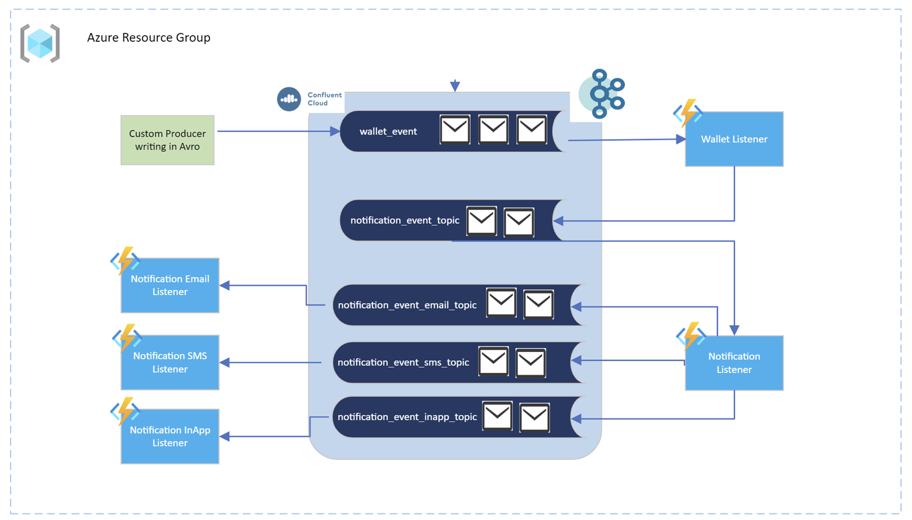
 
Pre-requisites:
1. An Azure account with an active subscription. [Create an account for free](https://azure.microsoft.com/free/?ref=microsoft.com&amp;utm_source=microsoft.com&amp;utm_medium=docs&amp;utm_campaign=visualstudio).
2. The [Azure Functions Core Tools](https://docs.microsoft.com/en-us/azure/azure-functions/functions-run-local#v2) version 4.x.
3. The [Azure CLI](https://docs.microsoft.com/en-us/cli/azure/install-azure-cli) version 2.4 or later.
4. JDK 8 or the latest version (e.g., [OpenJDK](https://openjdk.java.net/projects/jdk/11/%5D)).
5. A recent version of [Maven](https://maven.apache.org/download.cgi).
6. Create [Confluent Cloud on Azure using Azure Marketplace](https://docs.microsoft.com/azure/partner-solutions/apache-kafka-confluent-cloud/create?WT.mc_id=data-28802-abhishgu) - Confluent Cloud is a fully managed Kafka service. Confluent Cloud integrates with your Azure billing account.
7. Function app set to a [Azure Functions Premium Plan](https://docs.microsoft.com/en-us/azure/azure-functions/functions-premium-plan). Use the following [link](https://docs.microsoft.com/en-us/azure/azure-functions/functions-premium-plan#create-a-premium-plan) for instructions on how to first create an Azure Functions Premium plan Function app. Note the name of the Function app.
8. Setup the environment.
    - [Create an instance of Apache Kafka and the topics needed in a Confluent Cloud managed Kafka cluster](https://docs.microsoft.com/en-us/azure/partner-solutions/apache-kafka-confluent-cloud/create)
    - [Create an instance of Azure functions](https://docs.microsoft.com/en-us/azure/azure-functions/functions-premium-plan)

# Build and deploy the producer and consumer applications to Azure functions

1. [Setup schema registry for the wallet\_event topic](https://docs.confluent.io/cloud/current/get-started/schema-registry.html#quick-start-for-schema-management-on-ccloud).
2. Setup a producer code to write Avro serialized messages to a Kafka topic.
3. Setup Kafka trigger apps to track the events arriving at various Kafka topics.

# Execute the Kafka producer to generate events

1. Run the producer program to produce serialized messages into the Kafka topic

Here is a view of the Kafka topic once the producer executes. As you can see the value is in serialized Avro (generic format).

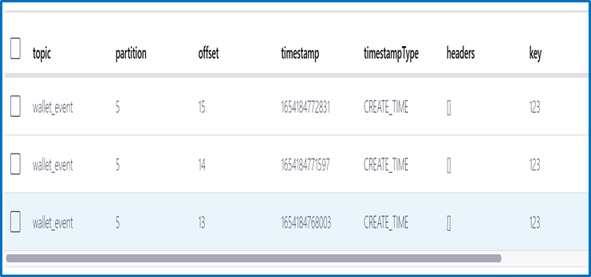  
 
1. This invokes the function apps listening to the above topic. Thanks to the Confluent.SchemaRegistry.Serdes.Avro package which helps convert the Avro(generic) format message to string. The extension provides this package for you to perform this conversion.

Here is the table view of the topic:

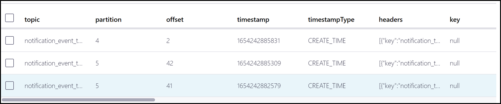

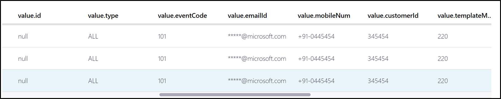

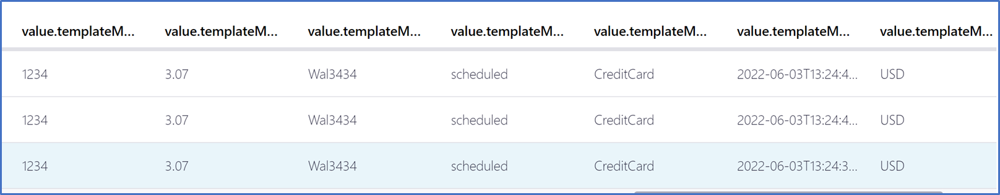

Here is the value view of the topic where Avro(generic) value is converted to string:

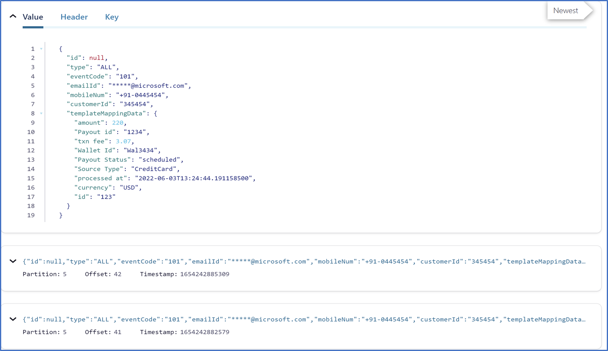

1. If you have noticed this topic there is header data included as well. The Confluent.Kafka package within the Azure functions Kafka extension includes header supported libs which can be used to initiate the header data. This can be further wrapped into the message and passed onto the Kafka topic.

Here is the view of the Kafka topic receiving the message along with header data:

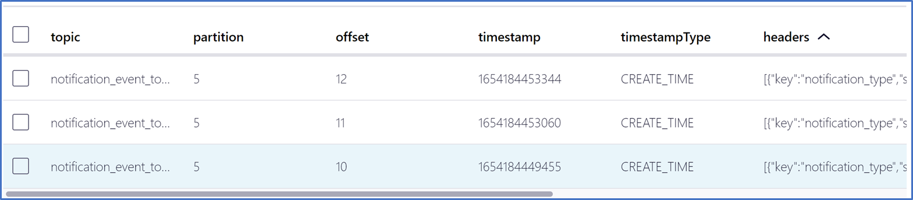

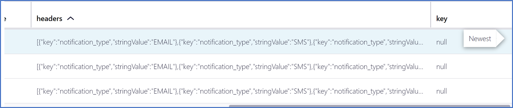

Here is how the header data looks:

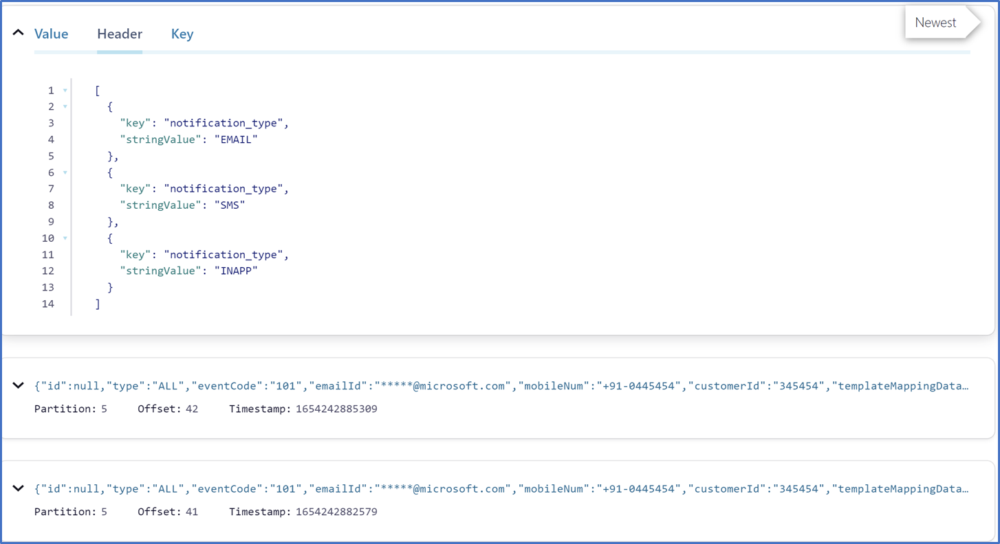

1. Based on the header data the corresponding topic is populated with email message as shown below:

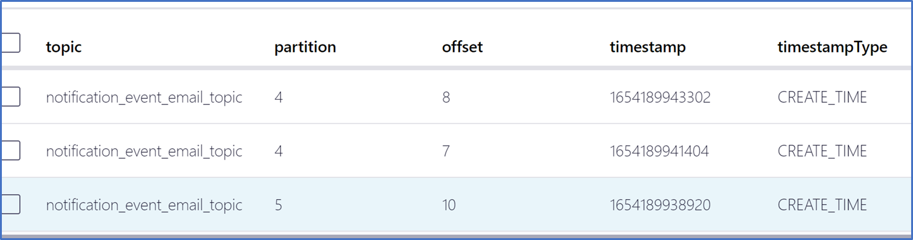

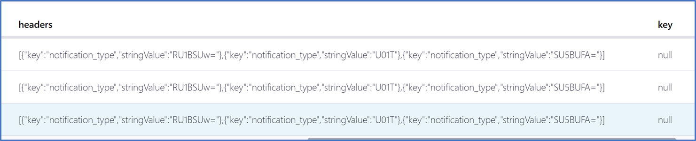

**Clean Up**

1. Delete the resources (Azure function&#39;s instance – Kafka trigger apps, Kafka clusters hosted on Confluent Cloud – topics, schema registry)

The next section provides a summary of how to set up the Azure services and infrastructure to build the entire solution. References to the documentation and other resources are provided where applicable.

# Setup the Kafka cluster using Confluent Cloud on Azure offering

Provision a [Confluent Cloud cluster on Azure Marketplace](https://docs.microsoft.com/azure/partner-solutions/apache-kafka-confluent-cloud/create?WT.mc_id=data-28802-abhishgu). 
**Provide configuration details**  for creating a Confluent Cloud organization on Azure. Post completion of creation steps a Confluent organization is created which can be identified through Azure portal and using single sign-on url you can directly login to Confluent cloud UI portal.

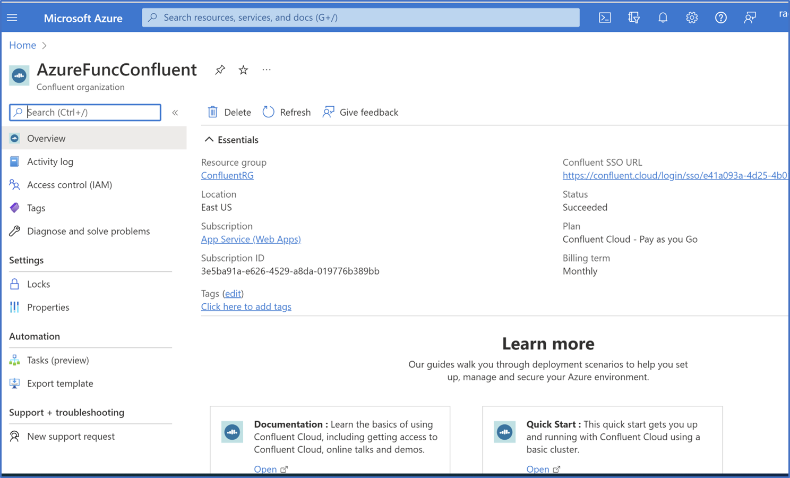

Create a new Kafka cluster in the default environment or create a new environment and then create a cluster once you login. To minimize your data transfer costs, you should provision a cluster in the same Azure region where your Functions App will run.

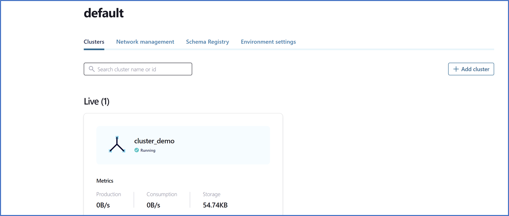

# Setup the schema registry

Confluent Cloud [Schema Registry](https://docs.confluent.io/cloud/current/get-started/schema-registry.html#quick-start-for-schema-management-on-ccloud) helps to manage schemas in Confluent Cloud. Enable schema registry once you login to the cluster. Select the schema registry region closer to the cluster. To use Confluent Cloud Schema Registry for managing Kafka clusters, you need an API key specific to Schema Registry. Click the  **Schema Registry**  tab, then click  **Edit**  on the  **API credentials**  card. Create a new set of API key and secret and note down the values.


# Create the topics

Create new [Kafka Topics](https://docs.confluent.io/cloud/current/client-apps/topics/manage.html) as follows using the default topic settings.

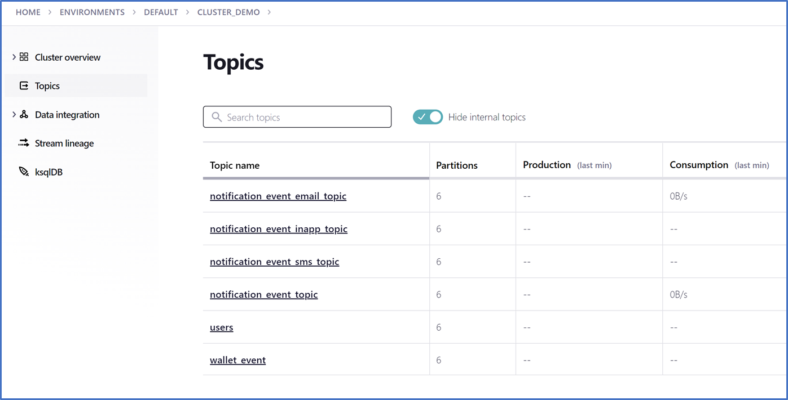

Then Select the topic – wallet\_event, click the  **Schema**  tab for that topic. Select a schema format type (for this example,  **Avro** ), paste the schema (such as the wallet.json content), and click  **Save**.

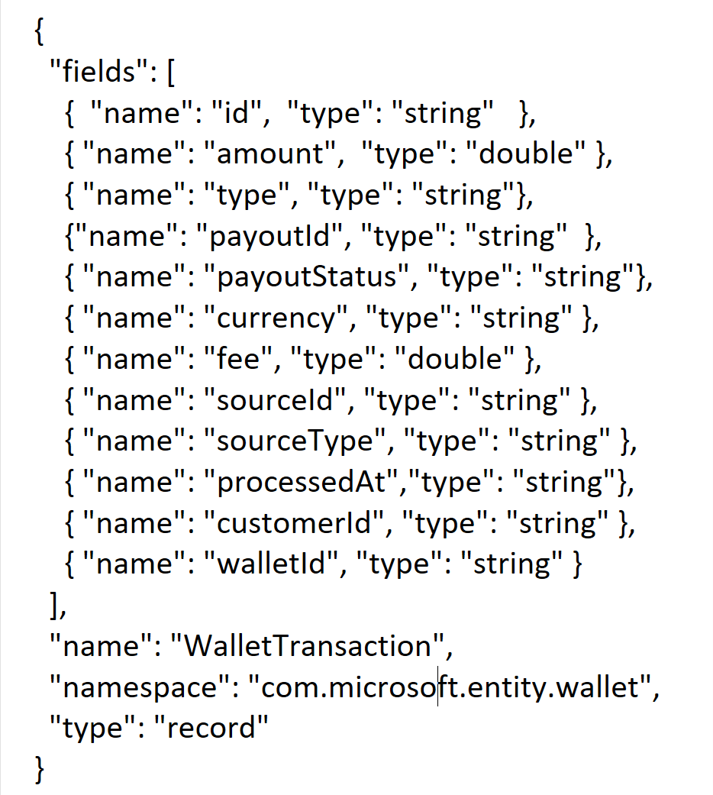

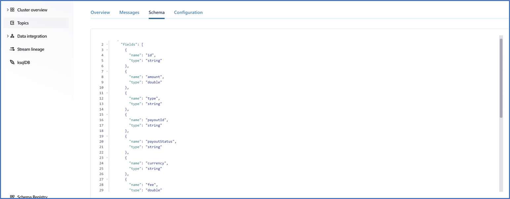

Here is the view of the topic wallet\_event once the schema is mapped:

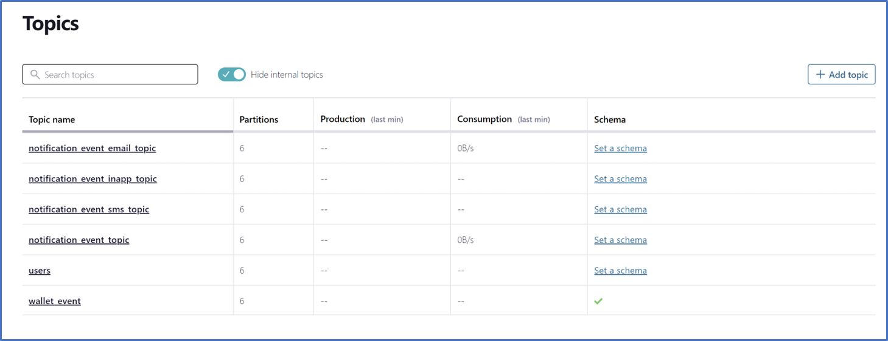

Create a new API Key and Secret which can be found under the Cluster-> Data Integration -> API keys - note these values

# Update the code

- Clone [this repository](https://github.com/Azure/azure-functions-kafka-extension/tree/dev/samples/WalletProcessing_KafkademoSample) using Git to a folder.
- Update the local.settings.json file to point to your Kafka cluster that you set up in the previous step.

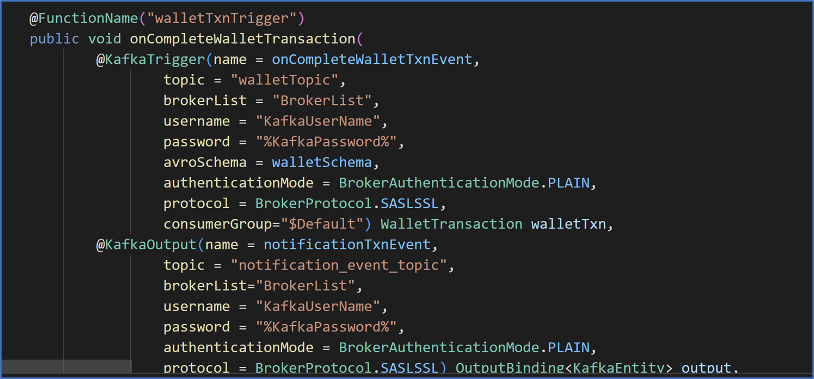

Replace the following values in the the local.settings.json which will be referenced by the Function trigger :

- **BrokerList** : should contain the value of Bootstrap server found in Confluent Cloud settings page. Will be something like &quot;pkc-xyzxy.westeurope.azure.confluent.cloud:9092&quot;.
- **KafkaUserName** : This is your API access key, obtained from the Confluent Cloud web portal.
- **KafkaPassword** : This is your API secret, obtained from the Confluent Cloud web portal.
- Add the topic names which were created in the previous step to the local.settings.json file

Update the producer-config.properties file. These values will be leveraged by the WalletProducer to generate wallet events into the Kafka topic.

**Bootstrap server** : should contain the value of Bootstrap server found in Confluent Cloud settings page. Will be something like &quot;pkc-xyzxy.westeurope.azure.confluent.cloud:9092&quot;.

**Schema.registry.url** : This is the endpoint for your apps to communicate with Schema Registry found under API end point in the Schema registry.

**Sasl.jaas.config** : Replace the username and password with Schema Registry API key and secret that you created and saved in the earlier step.

Update the **schemaRegistryUrl** in pom.xml with the API endpoint of the Schema registry.

# Now lets see things in action!! 

Now that we have all the components in place, we can test the end-to-end functionality. Lets build and run the function&#39;s code by starting the local Functions runtime host from the folder which has been cloned :

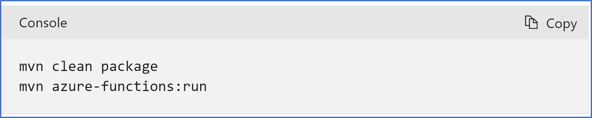

You should see that the worker process has been started and initialized.

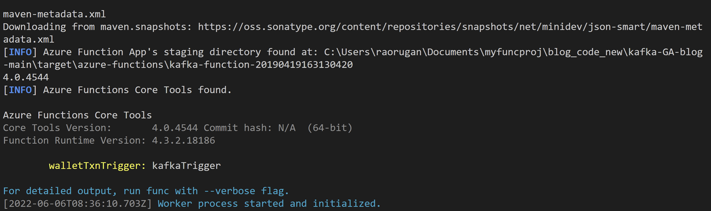

Run the WalletProducer.java to generate messages into the Kafka topic wallet\_event. This will trigger the function app to de-serialize the avro data and add header data and send a message to notification\_event\_topic. The NotificationListener function app gets invoked and send the notification message to the corresponding notification topic i.e – email, sms, in-app which will in-turn trigger the function app to finally send these notification messages.

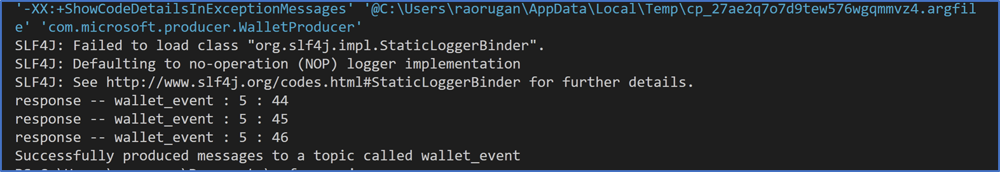

# Deploy the app to Azure Functions Premium Plan

Now you are ready to deploy this Function app to a [Azure Functions Premium Plan](https://docs.microsoft.com/en-us/azure/azure-functions/functions-premium-plan). Use the following [link](https://docs.microsoft.com/en-us/azure/azure-functions/functions-premium-plan#create-a-premium-plan) for instructions on how to first create an Azure Functions Premium plan Function app. Note the name of the Function app.

- To enable scaling in the Premium Function app currently you have to toggle a property on the Function app.
- To enable scaling in the Premium Function app currently you have to toggle a property on the Function app.

You can use the Azure Portal to toggle the Runtime Scale Monitoring setting under Function runtime settings

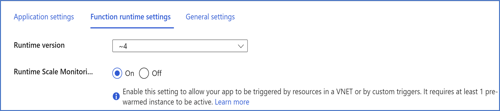

You can now deploy your locally created Function app to the app created in Azure by using the following [func command](https://docs.microsoft.com/en-us/azure/azure-functions/functions-run-local?tabs=windows,csharp,bash#publish) by replacing the  **NameOfFunctionApp**  with the name of the Function app created in Azure in the previous step.
 Note: To use this command from Az CLI you have to be logged into Azure using Azure CLI.

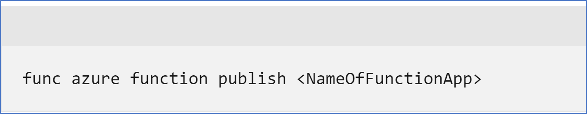

**OR**

Update the following in the pom.xml **schemaRegistryUrl**, **functionAppName**, **functionAppRegion**, **functionResourceGroup** with the corresponding schema registry API endpoint, Function App name, region and resource group to be created.

Execute the following command to deploy to azure:

```azurecli
**mvn azure-functions:deploy**
```

Note: Ensure the function app&#39;s configuration – Application settings are updated with Kafka broker, API key/secret and topics similar to the configuration in local.settings.json.

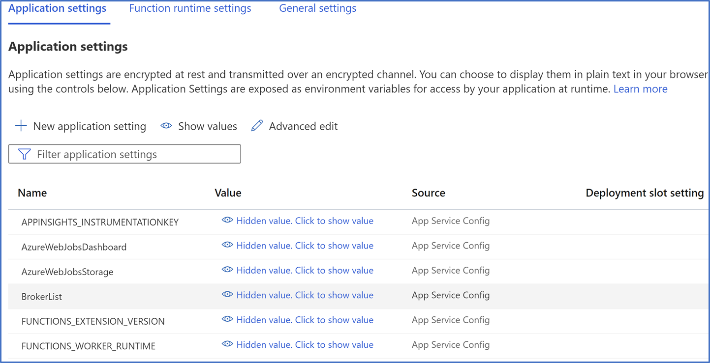

If everything works well you will see the notification messages flowing into notification\_event\_topic , notification\_event\_email\_topic , notification\_event\_sms\_topic and notification\_event\_inapp\_topic.

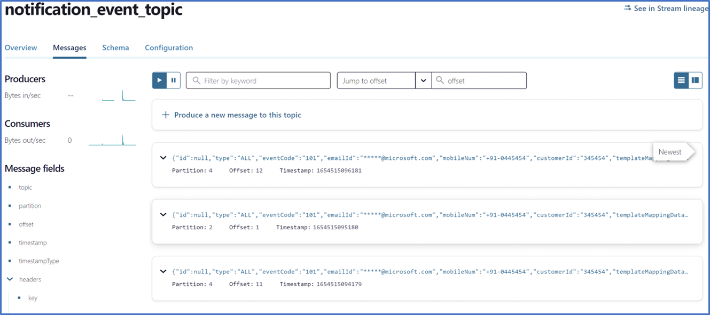

Finally, you can head over to the portal and for example use the [Live Metrics view](https://docs.microsoft.com/en-us/azure/azure-monitor/app/live-stream) to see the logs and requests.

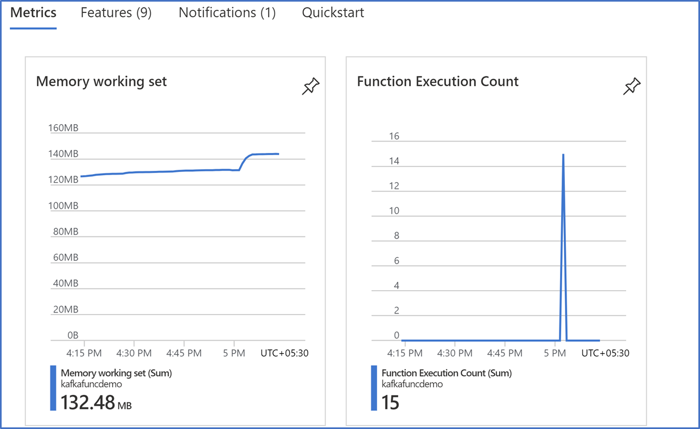

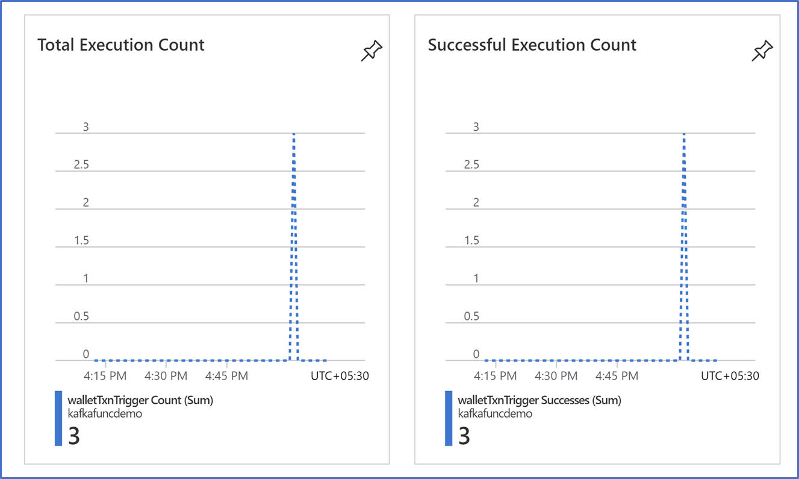

# Clean up the resources

Once you&#39;re done, delete the services so that you do not incur unwanted costs. If they are in the same resource group, simply [deleting the resource group](https://docs.microsoft.com/azure/azure-resource-manager/management/delete-resource-group?tabs=azure-portal&amp;WT.mc_id=data-14444-abhishgu#delete-resource-group) will suffice. You can also delete the resources (Confluent Cloud organization, Azure functions) individually.

# References 

[Apache Kafka bindings for Azure Functions | Microsoft Docs](https://docs.microsoft.com/en-us/azure/azure-functions/functions-bindings-kafka?tabs=in-process%2Cportal&amp;pivots=programming-language-csharp)

 If you encounter any issues or would like to provide feedback on Kafka trigger extension, please report them to our GitHub repository- [Issues · Azure/azure-functions-kafka-extension (github.com)](https://github.com/Azure/azure-functions-kafka-extension/issues)

This extension is being developed in the open-source community. Please contribute, try out and post any issues on the [Azure Functions Kafka extension GitHub repo](https://github.com/Azure/azure-functions-kafka-extension)

Keep in touch with us on Twitter via @[AzureFunctions](https://twitter.com/AzureFunctions).