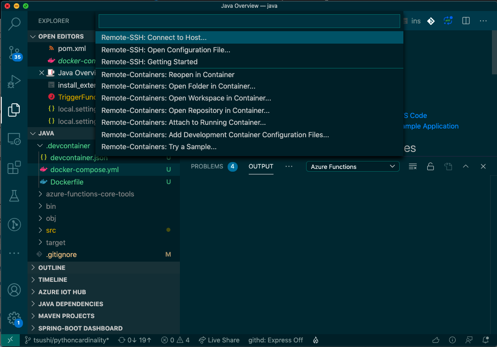

# Developers guide for Kafka Functions for Javascript

Explain how to configure and run the sample.

## Prerequisite

If you want to run the sample on Windows, OSX, or Linux, you need to following tools.

* [Azure Function Core Tools](https://github.com/Azure/azure-functions-core-tools) (v3 or above)
* [Node.js](https://docs.microsoft.com/en-us/azure/azure-functions/functions-reference-node#node-version) (10 or 12)
* [AzureCLI](https://docs.microsoft.com/en-us/cli/azure/install-azure-cli?view=azure-cli-latest)

However, If you can use [DevContainer](https://code.visualstudio.com/docs/remote/containers), you don't need to prepare the development environment. For the prerequisite for the dev container is:

* [Docker for Windows](https://docs.docker.com/docker-for-windows/) or [Docker for Mac](https://docs.docker.com/docker-for-mac/install/)
* [Visual Studio Code](https://code.visualstudio.com/)
* [Visual Studio Code - Remote Development extension](https://marketplace.visualstudio.com/items?itemName=ms-vscode-remote.vscode-remote-extensionpack)

DevContainer will set up all of the prerequisites includes [AzureCLI](https://docs.microsoft.com/en-us/cli/azure/install-azure-cli?view=azure-cli-latest) with local Kafka Cluster.

## Start the DevContainer

Go to the `samples/javascript` directory then open the Visual Studio Code.

```
$ cd samples/javascript
$ code .
```

Visual Studio might automatically ask you to start a container. If not, you can click the right bottom green icon (><), then you will see the following dropdown.



Select `Remote-Containers: Reopen in Container.` It starts the DevContainer, wait a couple of minutes, you will find a java development environment, and a local Kafka cluster is already up with Visual Studio Code.

### Two Samples

In the table below, `Kafka Cluster` local means that the sample users a Kafka cluster that is started with the DevContainer.

| Name | Description | Kafka Cluster| Enabled |
| ----- | --------------- | -------| ---|
| UsersTrigger | Simple Kafka trigger sample | local | yes |
| UsersTriggerMany | Kafka batch processing sample with Confluent Cloud | Confluent Cloud | no |


### Modify function.json_ and local.settings.json

If you want to use the `UsersTriggerMany` sample, rename `UsersTriggerMany/function.json_` to `UsersTriggerMany/function.json`. This allows the Azure Functions Runtime to detect the function.

Then copy `local.settings.json.example` to `local.settings.json` and configure your [ccloud](https://docs.confluent.io/current/cloud/cli/index.html) environment.

## Install the KafkaTriggerExtension

This command will install Kafka Extension. The command refer to the `extensions.csproj` then find the Kafka Extension NuGet package.

```bash
$ func extensions install
```

Check if there is dll packages under the `target/azure-functions/kafka-function-(some number)/bin`. If it is success, you will find `Microsoft.Azure.WebJobs.Extensions.Kafka.dll` on it. 

## Run the Azure Functions

## Run 

Before running the Kafka extension, you need to configure `LD_LIBRARY_PATH` to the `/workspace/bin/runtimes/linux-x64/native"`. For the DevContainer, the configuration resides in the `devontainer.json`. You don't need to configure it.

```bash
$ func start
```

### Deploy to Azure

#### Deploy the app

Deploy the app to a Premium Function You can choose.

* [Quickstart: Create a function in Azure using Visual Studio Code](https://docs.microsoft.com/en-us/azure/azure-functions/functions-create-first-function-vs-code?pivots=programming-language-javascript)
* [Quickstart: Create a function in Azure that responds to HTTP requests](https://docs.microsoft.com/en-us/azure/azure-functions/functions-create-first-azure-function-azure-cli?tabs=bash%2Cbrowser&pivots=programming-language-javascript)
* [Azure Functions Premium plan](https://docs.microsoft.com/en-us/azure/azure-functions/functions-premium-plan)

#### Configure AppSettings

Go to Azure Portal, select the FunctionApp, then go to Configuration > Application settings. You need to configure these application settings. `BrokerList`, `ConfluentCloudUsername` and `ConfluentCloudPassowrd` are required for the sample.
`LD_LIBRARY_PATH` is required for Linux based Function App. That is references so library that is included on the Kafka extensions. 

| Name | Description | NOTE |
| BrokerList | Kafka Broker List | e.g. changeme.eastus.azure.confluent.cloud:9092 |
| ConfluentCloudUsername | Username of Confluent Cloud | - |
| ConfluentCloudPassword | Password of Confluent Cloud | - |
| LD_LIBRARY_PATH | /home/site/wwwroot/bin/runtimes/linux-x64/native | Linux only |

#### Send kakfka event

Send Kafka events from a producer, and you can use [ccloud](https://docs.confluent.io/current/cloud/cli/index.html) CLI for the confluent cloud.

```bash
$ ccloud login
$ ccloud kafka topic produce message
```

For more details, Go to [ccloud](https://docs.confluent.io/current/cloud/cli/command-reference/ccloud.html).

If you want to send an event to the local Kafka cluster, you can use
[kafakacat](https://docs.confluent.io/current/app-development/kafkacat-usage.html) instead.

```bash
$ apt-get update && apt-get install kafkacat
$ kafkacat -b broker:29092 -t users -P
```

# Resource

* [Quickstart: Create a function in Azure using Visual Studio Code](https://docs.microsoft.com/en-us/azure/azure-functions/functions-create-first-function-vs-code?pivots=programming-language-javascript)
* [Quickstart: Create a function in Azure that responds to HTTP requests](https://docs.microsoft.com/en-us/azure/azure-functions/functions-create-first-azure-function-azure-cli?tabs=bash%2Cbrowser&pivots=programming-language-javascript)

* [Confluent cloud Quick Start](https://docs.confluent.io/current/quickstart/cloud-quickstart/index.html#cloud-quickstart)

